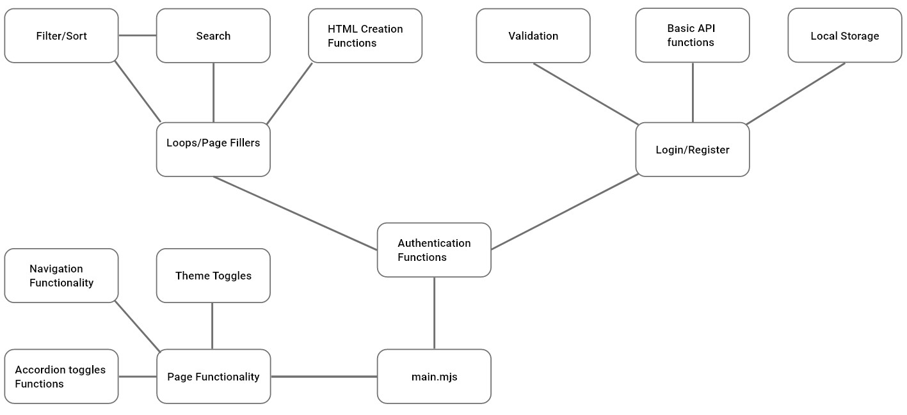

> # Socia Media Platform Plan

> ## Table of Contents

1. [GitHub Projects Link](#GitHubPlan)
2. [Design](#design)
3. [Requirements](#Requirements)
4. [Tasks](#TasksOutline)
5. [Functions](#PossibleFunctions)

> ## Planning 

[GitHub Project Link](https://github.com/users/Anclagen/projects/1)

> ## Design 

[XD design link](https://xd.adobe.com/view/59c5671d-0fe9-4e34-9a22-d341ef432053-0c96/screen/d9b31299-3670-46f6-8ffa-154707132aa4)

> ## Requirements 

### **Required Features**

The following user stories are required for a passing submission:

    User with @noroff.no or @stud.noroff.no email can register profile
    Registered user can login
    User can view a post content feed
    User can filter the post content feed
    User can search the post content feed
    User can view a post content item by ID
    User can create a post content item
    User can update a post content item
    User can delete a post content item

### **Additional Features**

The following user stories are optional:

    User can create a comment on a post
    User can edit profile media
    User can follow/unfollow a profile
    User can react to a post content item

> ## Task Outlines 

1. Setup
   - Create GitHub project plan.
   - Create Repository.
   - Create JS2 development branch.
   - Finalise design colours/typography/etc..
2. Create login/sign-up page.
   - Update SoSocial login page to include sign-up form.
   - Validation inputs.
   - Registration users.
   - Login users.
   - Setup local storage functions for access-token.
   - Toggler to switch forms.
3. Create profile page.
   - Modify SoSocial profile page to conform to profile data.
   - Get user profile data.
   - Get users post/followers data.
   - Grab query strings for other users profiles.
   - \*Update users profile data.
   - \*Follow/unfollow other users.
4. Create posts page.
   - Get all post data.
   - Create a new post.
   - Delete a post.
   - Update a post.
   - Sort/filter posts.
   - Search posts.
   - View individual posts (\*plus their reply chain).
   - \*Reply to a post.
   - \*Reply to a reply of a post.
   - \*React to a post.
5. Peer review, and improvement.
   - Submit first version for review.
   - Review at least 2 other students projects.
   - Add issues based on feedback.
   - Resolve issues and implement improvements.
   - Create pull request from JS2 to main branch.
   - Ask a teacher for peer review, including areas of concern.
   - Add this teacher as a reviewer on your PR.
   - Resolve issues and implement changes.
   - Submit open PR request.

> ## JS Modules File Structure

> ## Passed Objects

    - user to be stored after login.
        - { "name": "my_username",
            "email": "first.last@stud.noroff.no",
            "avatar": "https://img.service.com/avatar.jpg",
            "accessToken": "eyJhbGciOiJIUzI1NiIsInR5cCI6IkpXVCJ9...." }

> ## Possible Functions 

### **Login/Register**

    - createUser(username, email, password, avatar, banner)
    - authenticateLogin(email, password)
        - validateEmail(email)
        - validatePassword(password)
        - confirmPassword(password/password confirmation)
    - logout()
    - toggleForm()

### **Local Storage**

    - saveLocal(key, value)
    - getLocal(key)
    - removeLocal(key)

### **API Requests and Posts**

    - getQueryStrings(queryString)
    - generateURL(access-token??, queryString, filters)
    - getData(url)
    - updatePost(id, body, access-token)
        - validateAuthor(username)??? or if statement on post options menu?
    - postComment(id, body, access-token, {optional-comment-id})
        -Event Listener for post input.
    - postReaction(id, symbol, access-token)
    - deletePost(id, access-token)

    Possible additional functionality:
    - Function to control pagination of post results.

### **Filters, and Search**

    - updateFilter(FilterOptionSelected)
        -Event Listener for select element.
    - searchPosts(post-data)
        -Event Listener for search input.
        -edit post url with search params?

    Possible additional functionality:
    - Additional sorting based on author/comments/reactions/tags/media included.

### **Content Creators**

    - createLoginOverlay() or redirect unknown users to login-page.
    - createPostHTML(post-data)
    - createProfileHTML(profile-data) ??fillProfileInfo
    - createReplies(post-data)
    - createFollowers(followedUserData)

### **Additional Site Functionality**

    - toggleHamMenu()
    - toggleAccordion(btn ID, content ID)
    - expandModal(post/media ID)
    -

> ### Questions

- No search functionality in docs, get all posts and filter?
- How to test registration functionality?
